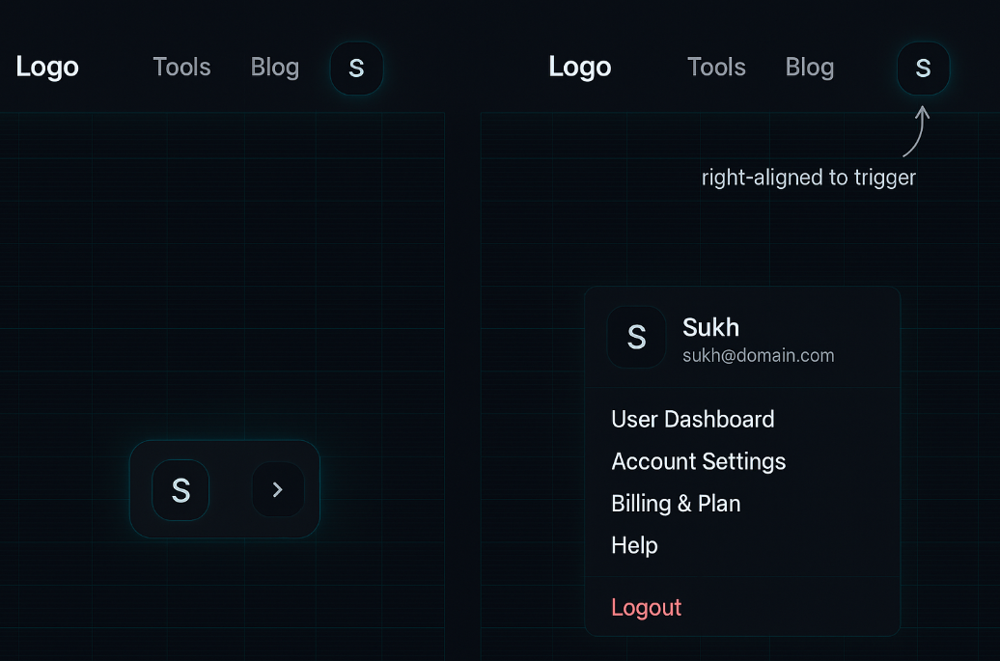

Total things pending
1. Blog
2. Subscription
3. User Dashboard
4. Admin dashboard
5. Auth (Bugs)
6. Report Generation
7. AI Chatbot
8. Mini pages (privacy policy/ terms and conditions/ etc)
9. Whole website UI

week 1   (sep  1 -  6) : Tools page, User dashboard, 2 mini pages
week 2   (sep  7 - 13) : Tools page, Subscription, other mini pages
week 3   (sep 14 - 20) : Tools page, Report Generation, AI Chatbot
week 4   (sep 21 - 27) : AI Chatbot, 
ending   (sep 28 - 31) : AI Chatbot, Bugs and other fixes

# BUGS/UPDATES
## AUTH
- user deactivated logic to be written in local_routes
- mfa not set yet
- On register (fe), create checks on frontend too so backend does little work (like pw checks, both pw same, etc)
- refresh token not working 
- refresh tokens are not revoking, revoke at 1. when it expired we got to know 2. cron job revoking regularly
- Google one tap not working
- Auth login/register the input sections are not same size
- Auth when pressed login button, it becomes dark and not visible
- csrf on cookie flows (since jwt is in cookies, enable csrf protection on all required endpoints)
- rate limits set up for all endpoints (signin, verify mfa, forgot, reset pw, refresh)
- cron to revoke expired tokens
- email queueing so it's not blocked by smtp
- throttle resend verify
- login event is in db, make it work so we know the active users per day per month more easily rather than calculating every time...
## NAVBAR
- Dropdown from User needs design update
- Dropdown also needs admin dashboard for admins only
- Dropdown needs complete restyling like this image - 
## FOOTER
- Add social links
## MAILS
- Confirm mail design update required
- Reset Password mail design update required
## LANDING PAGE
- hero section touching navbar in laptop screen
- Why hunters love us --> that heart does not look interesting
- Choose your arsenal needs to be updated - tools are no longer served solo differently
- Watch demo button not required, maybe replace it or remove it and fix design bcoz the other button will not be looking good after removing this
- A section in which we show how we can use tools (a little gif or quick vid)
- Change scrollbar color
## TOOLS
- Launch button pressed multiple times without changing parameters is throwing errors
- use celery to run the processes in backend
- Files are being saved in app.py's folder on server
## ADMIN PAGE
- Auth page for admin section
- Page - analytics
- Page - tools
- Page - blogs
- Page - admins
- Page - audit logs
- Page - settings
- Show admin user details in the left panel rather than static details
## BLOG
- Like/comment functionality
- Blog detail UI fix
- Blog list UI fix
## ROLES
- Check and confirm all the roles
- Enforce all the roles
## FINAL UPDATES
- Change db from sqlite to postgresql
- Using the in-memory storage for tracking rate limits as no storage was explicitly specified. -- solve this warning we receive in terminal when we run the server
## CREDENTIAL UPDATES REQUIRED
- Github oauth id/secret
- Google oauth id/secret
- cloudflare turnstile creds
- mail id pw 

# TODO DONE LIST
## FOOTER
- Footer bg needs to be a little darker, just like navbar
## LANDING PAGE
- The overlay (opacity change) flowing down is too fast, slow the speed (for all pages)
- Launch scan button should lead to tools page
## AUTH
- unable to logout
## ADMIN
- Logout button not working
## NAVBAR
- Dropdown needs user dashboard

